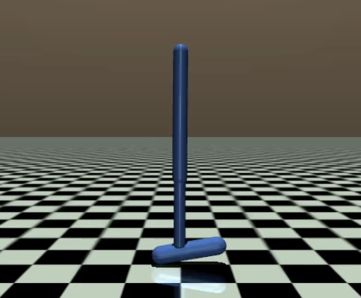

# Meta-Reinforcement-Learning Through Task Inference Reutilization
Meta-Reinforcement Learning with an encoder module which infers tasks from contexts. Idea is to train the task inference module on a simple agent (toy) depicted below and transfer it to more complex agents from the mujoco environment. The method has been tested on the agents shown below.
|  |  |  |  |
|:-----------------------------:|:-----------------------------:|:-----------------------------:|:-----------------------------:|
| **Toy**                   | **Cheetah**                   | **Walker**                   | **Hopper**                   |

This project implements the algorithm decribed in [this thesis](Master_Thesis_Juan_final.pdf) in which an inference-based Meta Reinforcement Learning algorithm was trained in the toy environment and then reused in a more complex agent. In order to transfer the knowledge trained on the simple agent, a hierarchical policy structure is implemented. The tasks for which this method has been tested are reaching a position, running at a velocity and standing at an angle. The Meta Reinforcement Learning algorithm used in described in [9] ([melts](https://github.com/Ghiara/MELTS)).

This project is related to previous work, including work by Kate Rakelly et al. [1], David Lerch [2], Lukas Knak [3], Philipp Widmann [4], Jonas Jürß [5], **Durmann** [6], **Bing et al.** [9]

For more information about the theoretical background, please refer to my Master's thesis and to the references.

----------------------------------------------------------------------------

## Installation
### Cloning
Go to the GitHub repository website and select 'Code' to get an HTTPS or SSH link to the repository.
Clone the repository to your device, e.g.
```bash
git clone https://github.com/juandelos/MRL-Inference-Reutilization.git
```
Enter the root directory of this project on your device. The root directory contains this README-file.

### Environment

We recommend to manage the python environment with **conda** and suggest [Miniconda](https://docs.conda.io/en/latest/miniconda.html) as a light-weight installation.

> You may also use different environment tools such as python's *venv*. Please refer
to *requirements.txt* in this case. In the following, we will proceed with conda.

Install the environment using the ``conda`` command:
```bash
conda env create --file updated_environment.yml
```
If that doesn't do the job, try:
```bash
conda env create --file environment.yml
```
This might take some time because it needs to download and install all required packages.

Activate the new environment by running (Make sure that no other environment was active before.):
```bash
conda activate inference-reutilization
```

In case you need to update an existing environment, you can run
```bash
conda env update --file updated_environment.yml
```

### Initialize submodules
```bash
git submodule init
git submodule update
```

### Install Cuda and Pytorch
```batch
sudo apt install nvidia-cuda-toolkit
```
Check the cuda version
```batch
nvcc --version
```
Install pytorch:
```batch
conda install pytorch torchvision torchaudio cudatoolkit=11.8 -c pytorch
pip install torch==2.1.0 torchaudio==2.1.0 torchvision==0.16.0
```
This is a workaround for cuda version 10.1 which seems to work. For version 11.1 and further, it should be easier.
If you get the following error:
```bash
Traceback (most recent call last):
  File "<stdin>", line 1, in <module>
ImportError: cannot import name 'S' from 'sympy' (unknown location)
```
This can be solved by:
```bash
pip uninstall sympy
pip install sympy
```

### MuJoCo

For running MuJoCo environments, you will need the MuJoCo library binaries which you can download from [here](https://mujoco.org/download/mujoco210-linux-x86_64.tar.gz). You should extract them in the directory */root/.mujoco/mujoco210*. Additionally, you need to set the variable *LD_LIBRARY_PATH* to contain the path to the binaries:

```bash
export LD_LIBRARY_PATH=$LD_LIBRARY_PATH:/root/.mujoco/mujoco210/bin
export LD_LIBRARY_PATH=$LD_LIBRARY_PATH:/usr/lib/nvidia
```
If you don't want to set it every time you open a new terminal, write the export commands in the ~/.bashrc file.

Please read the [documentation](https://github.com/openai) *carefully* (It contains valuable hints on troubleshooting).

The python bindings for MuJoCo can be installed with

```bash
pip install mujoco-py
```

If running a script that requires mujoco gives you a problem that mentions X11, try runnning this.
```bash
export CC=/usr/bin/gcc
export CXX=/usr/bin/g++
```
If that solves it, you can copy that to the .bashrc file.

### Submodules

Install the submodules:
```bash
pip install -e ./CARE
pip install -e ./submodules/Meta_RL/submodules/meta-environments-main
pip install -e ./submodules/meta_rand_envs
pip install -e ./submodules/Meta_RL/submodules/MRL-analysis-tools-main
pip install -e ./submodules/rand_param_envs
pip install -e ./submodules/Meta_RL/submodules/rlkit
pip install -e ./submodules/SAC
pip install -e ./submodules/Meta_RL
pip install -e ./submodules/Meta_RL/submodules/symmetrizer
```

----------------------------------------------------------------------------

## Run code

There are three parts to the method. The important scripts are stored under the train_reutilization folder.

### 1. Train the toy
Update the config under configs/toy_config.py if necessary. Start the training with
```bash
python run_toy_training.py
```
This will save the results in the folder output/toy1d-multi-task.

### 2. Train low-level policy for new agent
Parallely train the low-level-controller. Important file is train_low_level_policy.py. In that file, import the config from submodules/SAC/env_configs. This defines which experiment to start. Then run the file with 
```bash
python train_low_level_policy.py
```
The results will be saved in the folder output/low_level_policy. This script will load a config under the folder experiments_configs. The default is the cheetah config. If you want to choose a different one use the flag --env.
```bash
python train_low_level_policy.py --env hopper
python train_low_level_policy.py --env walker2d
```
The environments loaded can be used to train parametric and non-parametric tasks. This has to be adjusted in the respective configs.

### 3. To transfer the knowledge there are two possibilities
#### 3.1 Reuse the policy from the toy as the high-level policy
Update the config under configs/transfer_config.py with the results obtained from training the toy and the lower level policy.
If more than one task should be learned, the striding predictor should be learned. First update the inference path with the path from the toy training and the complex_agent_config with the output from the low-level policy training. (Idea: learn the striding predictor with the low-level controller)

```bash
python train_striding_predictor.py
```

#### 3.2 Relearn the high-level policy
The other option is to learn the high-level policy from scratch. Also here, the inference path and the complex_agent_config have to be updated. Then run the training.

```bash
python train_high_level_policy.py
```

### 4. Visualize results
Some utility scripts are stored under the vis_utils folder. The training of the algorithms save the weights of the models, trajectories of the agents, as well as a progress.csv with the loss/rewards histories. Some files for visualizing those are:

- **plot_from_csv.py**: Plots the reward/loss history form the progress.csv
- **gif_from_video**: turns video into gif to visualize in VSCode
- **plot_latent.py**: Plots tsne from the toy training
- **test_tasks**: Loads models from retraining high_policy and plots trajetories.

### Alternative: Run only parametric task variations with encoder consisting of GRUs
In case a simple encoder is to be used, the implementation by Durmann can be used. To do so train the toy agent with the script run_experiment.py. Then the inference reutilization can be tested with the script new_model_eval.py. There you have to choose the low-level policy and the inference mechanism trained on the toy. You can do this by using following command with the updated paths:
```bash
python submodules/Meta_RL/smrl/transfer_function/new_model_eval.py --encoder_path <path_to_encoder_path> --agent_path <path_to_low_level_agent> --epoch <checkpoint_of_low_level_policy_to_use>
```

## Troubleshooting

1. In case you get the error: RuntimeError: Failed to initialize OpenGL
   
   Solve with following command:
   ```bash
   unset LD_PRELOAD
   ```
2. For error: Could not load the Qt platform plugin "xcb"... check the follwoing [link](https://stackoverflow.com/questions/71088095/opencv-could-not-load-the-qt-platform-plugin-xcb-in-even-though-it-was-fou).

## **NOTE**

The results shown in final_results for the agents walker and hopper might differ if rerun. The reason is that these agent were trained with a different dt and skip_frames as in the source code from the mujoco installation. To replicate the experiments, the source code must be change to mimic the dt and skip_frames of the cheetah.
----------------------------------------------------------------------------

## References

[1] Rakelly, K. et al. (2019) ‘Efficient Off-Policy Meta-Reinforcement Learning via Probabilistic Context Variables’, Proceedings of the 36th International Conference on Machine Learning, ICML 2019, 9-15 June 2019, Long Beach, California, USA: PMLR, pp. 5331–5340. Available at:
http://proceedings.mlr.press/v97/rakelly19a.html.

[2] Lerch, D. (2020) Meta-Reinforcement Learning in Non-Stationary and Dynamic Environments. Master's thesis. Technical University of Munich.

[3] Knak, L. (2021) Task Inference Based Meta-Reinforcement Learning for Robotics Environments. Master's thesis. Technical University of Munich.

[4] Widmann, P. (2022) Task Inference for Meta-Reinforcement Learning in Broad and Non-Parametric Environments. Master's thesis. Technical University of Munich.

[5] Jürß, J. (2022) Exploiting Symmetries in Context-Based Meta-Reinforcement Learning. Bachelor's thesis. Technical University of Munich.

[6] RLKIT:  https://github.com/rail-berkeley/rlkit

[7] Symmetrizer:  https://github.com/ElisevanderPol/symmetrizer/

[8] Durmann, J. (2023) Meta-Reinforcement Learning. Master's thesis. Technical University of Munich.

[9] Bing et al. (2024) Context-Based Meta-Reinforcement Learning With Bayesian Nonparametric Models


<!--This part is for links only and won't be displayed in Markdown previews-->
[RLKIT]: <https://github.com/rail-berkeley/rlkit> "RLKIT on GitHub"

[Symmetrizer]: <https://github.com/ElisevanderPol/symmetrizer/> "Symmetrizer on GitHub"
